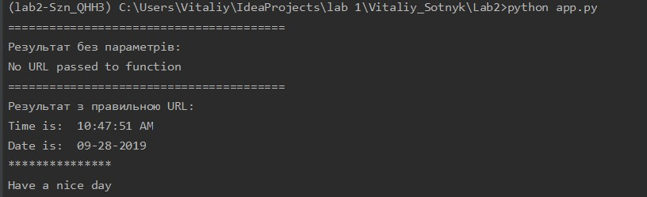

# LAB_2
#### 1. Створив папку Lab2 і файл README.md для виконання завдань.
#### 2. Використовуючи пакетний менеджер PIP інсталював pipenv на даний ПК та створив ізольоване середовище для Python.
#### 3. Встановив бібліотеки requests та ntplib для подальшогов виконання завдання.
#### 4. Створів файл app.py, у який помістив потрібний код.
#### 5. Командою python app.py переконався, що прогарама  працює коректно.
#### 6. Встановив бібліотеку командою pipenv install pytest.
#### 7. Створив файл test.py вписав потрібний код та командою pytest перевірив на роботоздатність.
#### 8. Протестував програму у файлі app.py  та отримав наступний результат: .
#### 9. Написав перевірку у файлі test.py  та командою pytest протестував її, та отримав результат:  
#### 10. Використавши перенаправлення даних файлу > і прописавши команду pytest test.py>result.txt, а також додав результат використовуючи >> командою python app.py>>result.txt  отримав результат роботи програми в текстовий файл.
#### 11. Закомітив зміни.
#### 12-13. Заповнив файл Makefile та закомітив зміни 

