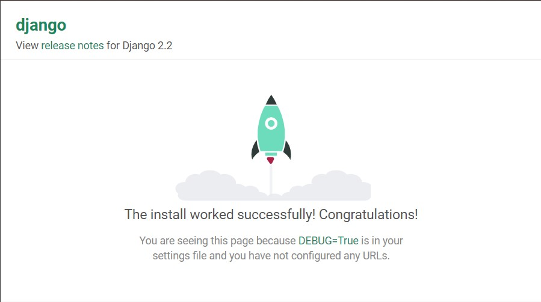

# LAB_3
#### 1.Ініціалізував середовище pipenv та встановив необхідні пакети.
#### 2.Створив заготовку проекту.
#### 3.Запустив Django сервер. 
#### 4.Сторив  файл html та urls.py. 
#### 5.Здійснив зміни у файлі my_site/settings.pyу змінній INSTALLED_APPS.
#### 6.Щоб поєднати функції із реальними URL шляхами за якими будуть доступні наші веб сторінки заповнив файл main/urls.py.
#### 7.Запустив сервер та переконався, що сторінки доступні.
#### 8.Встановив наступну бібліотеку: requests.