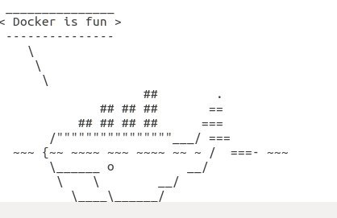
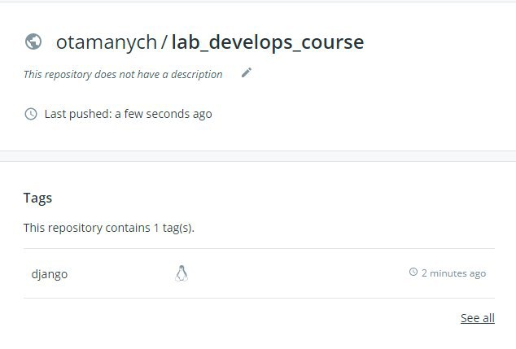

# LAB_4
#### 1.Встановив docker. Перенаправив наступні команди: docker -v, docker -h, docker run docker/whalesay comsay Docker is fun, в my_work.log отримав наступне зображення в файлі .
#### 2.Сторив і змінив вміст Dockerfile.Підключив власний git репозиторій.
#### 3.Зареєструвався на  docerhub. Створив там власний репозиторій та додав білд імедж, завантаживши [даний імедж](https://hub.docker.com/repository/docker/otamanych/lab_develops_course/tags?page=1)  в репозиторій .
#### 4.Створив файл, де є програма моніторингу.Виконав білд даного імеджа з тегом monitoring.Результати моніторингу перенаправив у server.log.

