# LAB_5
#### 1. Створив папки my_app & tests. У файлі requirements є необхідні бібліотеки для подальшої роботи. 
#### 2. Сервер запускається правильно та при переході на сайт видається помилка. 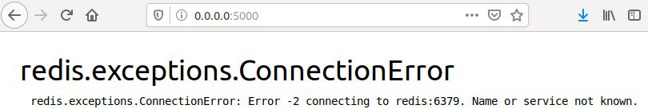 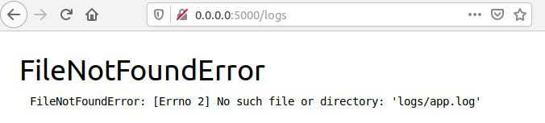
####

#### 3.Після роботи з google і пошуку вирішення проблеми, отримав наступне.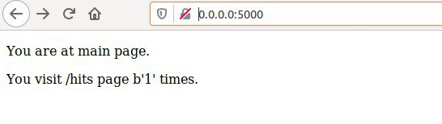 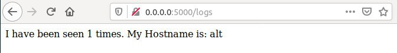
#### 4. Видалив файли та створив Dockerfile.app Dockerfile.tests Makefile.
#### 5. Директива Makefile:
####    STATES := app tests - присвоює змінній STATES розширений діапазон значень (app, tests), які перебираються при виконанні.
####    REPO := ... - присвоюємо змінній назву нашого докер-хабу
####    .PHONY: $(STATES) - Зазвичай утиліта make вважає, шо цілі (targets) є файлами, вони використовуються щоб створювати файли з інших файлів, але прописавши таку команду.
####     $(STATES): - прив'язує команди app та tests до певного правила, інструкції до якого прописані нижче з відступом. Виконання цього правила можна запустити шляхом вказання його назви.
####     @docker build -f Dockerfile.$(@) -t $(REPO):$(@) . - дана команда створює новий контейнер з контексту (файлів, що повинні використовуватися в майбутньому контейнері, в даному випадку в якості файлів використовуються всі, що знаходяться в даніій директорії.
####     run - Дане правило виконує створення мережі для подальшої можливої взаємодії контейнерів між собою (docker network create --driver=bridge appnet). Далі  запускаємо сервер-сховище (Redis) та раніше створений контейнер app. Параметр --rm - вказує на те, що контейнер буде видалено після закінчення його роботи, або по завершенню docker-процесу (daemon). --name - задає human readable (читабельне) ім'я контейнеру, що є необхідним якщо ми хочемо зробити щось з цим контейнером в майбутньому ми зможемо звернутись до нього за іменем. --net= - задає ім'я мережі, яку має використовувати контейнер, в даному випадку це раніше створена мережа appnet. Прапорець -d вказує на те, щоб контейнер запускався в бекграунді (background), тобто у фоновому режимі. Параметр -i (--interactive) та -t (--tty) створюють інтерактивний режим з прив'язкою до терміналу. В такому режимі можна взаємодіяти з контейнером та виконувати команди всередині контейнера. -p 5000:5000 - вказує що контейнер буде прив'язано до 5000 порту на машині на якій він запущений (5000:) та внутрішній порт контейнера (:5000).
####
#### 6. Створив, використовуючи команду make Docker імеджі для додатку та для тестів використовуючи команди make add, make tests, make run, make tests-add. 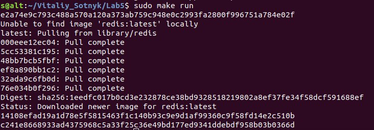 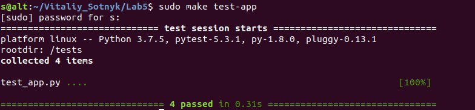
####
####    та отримав наступне: 
#### 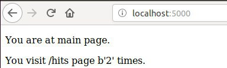 
#### 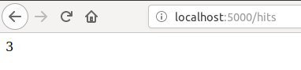 
#### 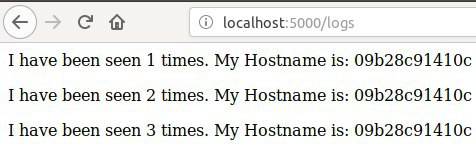
####
#### 7. Зупинив проект натиснувши Ctrl+C та почистив всі ресурси Docker за допомогою make, виконавши команду sudo make docker-prune.
#### 8. Створив директиву в Makefile для завантаження створених імеджів.
#### 9. Створив директиву в Makefile для видалення локальних імеджів.
#### 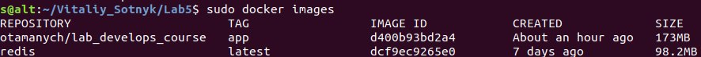
####
#### 10. Приступив до роботи з файлом docker-compose.yaml. Назви мереж які будуть використовуватися: public та secret. В даному випадку немає секретних даних які потрібно ховати від загального доступу, але у більш професійно-направлених проектах в будь-яких випадках з'являться дані, доступ до яких має мати тільки сам сервер. Тому доступ до сховища буде мати тільки контейнер з нашим додатком і ми не зможимо звернутись та витягнути дані на пряму зі сховища (Redis), але при цьому наш додаток буде працювати та отримувати необхідні дані зі сховища.
#### 11. Перевірив чи Docker-compose встановлений та чи він працює  командами docker-compose version та sudo docker-compose -p lab_5 up.
#### 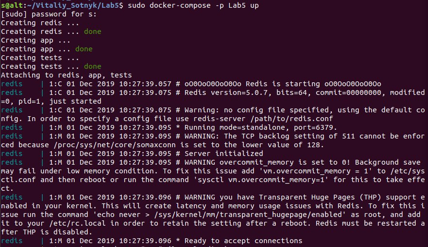 
####
#### Для роботи cайту теба ввести адресу http://0.0.0.0:80. Це зумовлено тим, що в docker-compose.yml файлі встановлено "expose"-порт 80.
#### 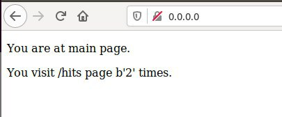 
#### 12. Docker-compose створив докер імеджі. Теги які були до тогo змінив, bobas/lab5-examples:compose-app та bobas/lab5-examples:compose-tests на otamanych/lab_develops_course:compose-app та otamanych/lab_develops_course:compose-tests. Змінив не самі теги, а репозиторій.
#### 13. Почистив ресурси створені компоуз виконавши команду  docker-compose down.
#### 14. Заватажив імеджі до хабу командою sudo docker-compose push.
#### 15. docker-compose працює лише з докером. Якщо потрібно виконати системні команди або щось з системою краще makefile.
#### 16. Взяв для роботи docker-compose.yaml з 5 лаби і використав його для виконання завдання. B файлі settings.py, що можна знайти таким шляхом Lab3/firstsite/, та змінивши дерективу ALLOWED_HOSTS = ['0.0.0.0', 'app'], запустив  усе командою sudo docker-compose - p Lab4 в папці Lab4.
#### Отримав наступний результат
#### 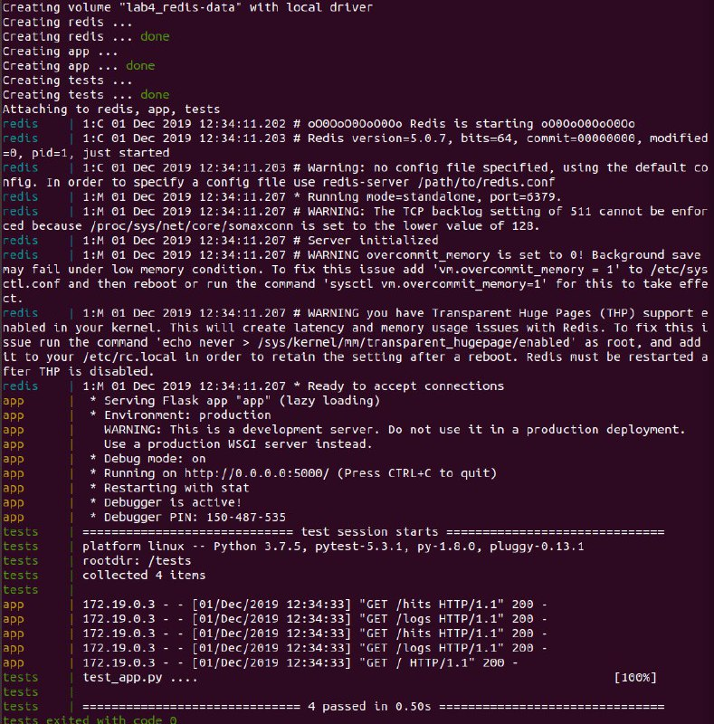

